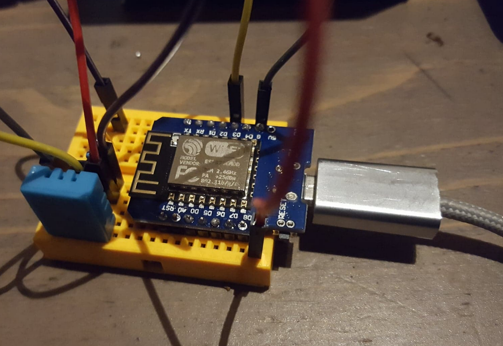

# esp probe


This is a simple project involving a remote temperature/humidity sensor, sending its data using UDP over a Wireless network to some influxdb instance.

It is designed to run on an `esp8266` chip.


## Usage

### Compile and write firmware on device

```
$ pio  run --target upload -e d1_mini
```

### Monitor serial output

```
$ pio device monitor
```


## Setup




_esp8266 mounted on a Weemos d1 mini_


I use a _Raspberry Pi_ as an access point - every sensor I use connects itself to this wireless access.
This device is also host an influxdb instance.

A grafana instance is also available on the _Raspberry Pi_, Grafana is quick to setup, provides nice charts and is able to directly query influxdb.

